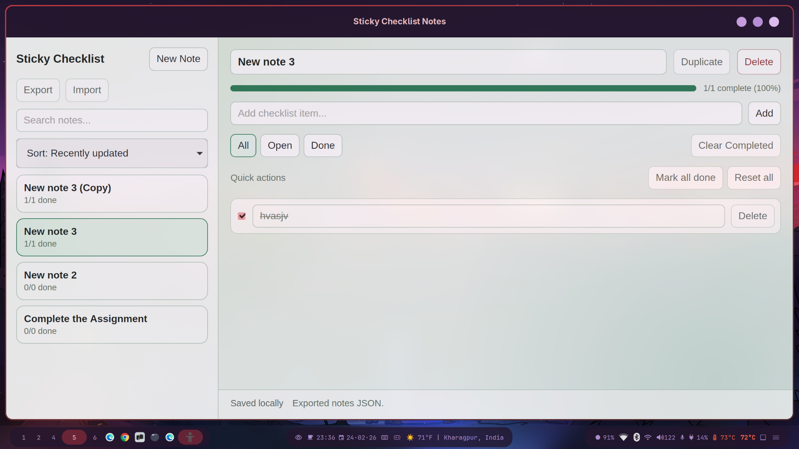

# Sticky Checklist Notes (Tauri + React)



Desktop checklist-notes app for Linux. You can:
- Create notes
- Search notes by title or checklist text
- Duplicate notes
- Export notes to JSON
- Import notes from JSON
- Edit note titles
- Add/edit/toggle/delete checklist items
- Filter checklist items (all/open/done)
- Clear completed checklist items
- Mark all checklist items done/reset
- Track completion progress
- Delete notes
- Keep notes persisted locally in app data

## Modular codebase

- `src/hooks/useNotes.ts`: state management and Tauri data operations
- `src/components/NotesSidebar.tsx`: note list/search/sort/import/export controls
- `src/components/NoteEditor.tsx`: checklist editor and bulk actions
- `src/utils/*`: import/export file helpers and note normalization utilities
- `src/types/note.ts`: shared domain types

## Import/Export format

- Export saves all notes as JSON.
- Import accepts a JSON array of notes and safely normalizes IDs and fields.
- Imported notes are merged into existing notes.

## App icon

- Source icon: `src-tauri/icons/app-icon.svg`
- Tauri generated icon set in `src-tauri/icons/` for Linux/Windows/macOS bundles.

## Arch Linux prerequisites

```bash
sudo pacman -S --needed \
  base-devel curl wget file openssl appmenu-gtk-module gtk3 \
  libappindicator-gtk3 librsvg xdg-utils webkit2gtk-4.1 \
  llvm clang lld
```

Install Node.js (LTS), npm, and Rust:

```bash
sudo pacman -S --needed nodejs npm rustup
rustup default stable
```

## Run in development

```bash
npm install
npm run tauri dev
```

## Build installable app/package

```bash
npm run tauri build
```

Build output will be generated under:
- `src-tauri/target/release/bundle/`
